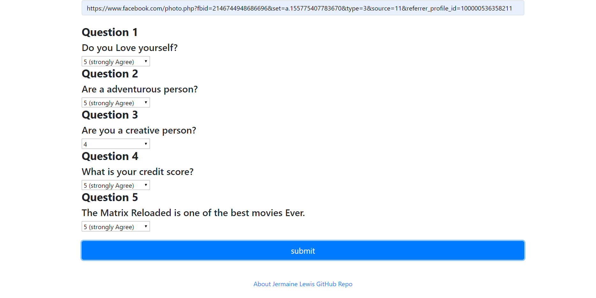
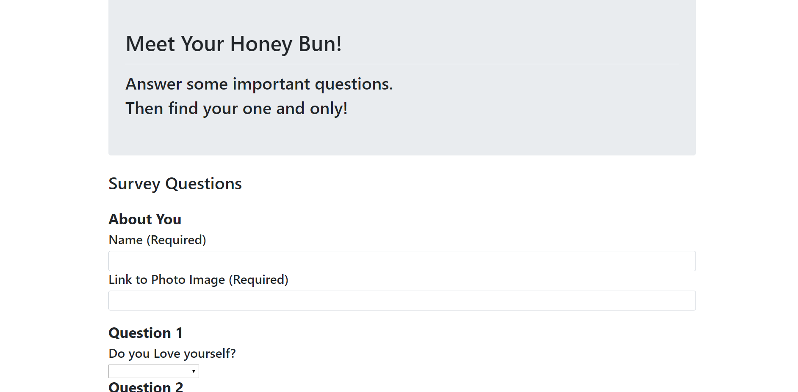

# FriendFinder
This APP is for finding a girlfriend/boyfriend. there is a couple of questions asked; to find the best match for the user. the way that is done; once the user clicks sumbit, a object containing four links to four different images of men/women should be displayed. Click [here](https://node-friend.herokuapp.com/) to view the website.

# Screenshots of The App
This is an image of the homepage:

This is an image of the questionnaire for best dating suggestion:

This is an image of the header in the survey section of the website:

# Technologies Used
- HTML
- CSS
- Javascript
- jQuery
- JSON
- Axios
- Express